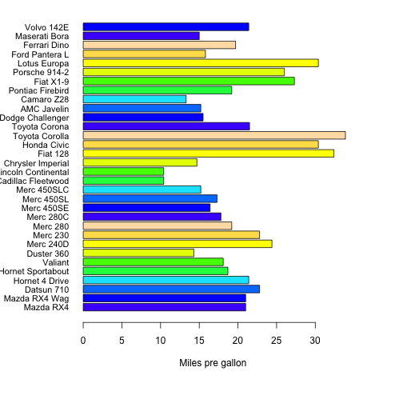

---
title       : Motor Trend Car Road Tests Result
subtitle    : Change cylinders and displacement to get miles per gallon on car
author      : peikuo
job         : Coursera Assignment
framework   : io2012        # {io2012, html5slides, shower, dzslides, ...}
highlighter : highlight.js  # {highlight.js, prettify, highlight}
hitheme     : tomorrow      # 
widgets     : [bootstrap, quiz, shiny, interactive]            # {mathjax, quiz, bootstrap}
mode        : selfcontained # {standalone, draft}

--- .class #id 

## Choose number of cylinders and displacement
On the left panel, you can change this two paramenters

<div class="row-fluid">
  <div class="container-fluid">
    <h2 style="padding: 10px 0px;">Motor Trend Car Road Tests Result</h2>
    <div class="row-fluid">
      <div class="span4">
        <form class="well">
          Choose number of cylinders and displacement to get the result of miles per gallon each car
          <br/>
          <br/>
          <div id="cyl" class="control-group shiny-input-radiogroup">
            <label class="control-label" for="cyl">Number of cylinders:</label>
            <label class="radio">
              <input type="radio" name="cyl" id="cyl1" value="4" checked="checked"/>
              <span>4</span>
            </label>
            <label class="radio">
              <input type="radio" name="cyl" id="cyl2" value="6"/>
              <span>6</span>
            </label>
            <label class="radio">
              <input type="radio" name="cyl" id="cyl3" value="8"/>
              <span>8</span>
            </label>
          </div>
          <br/>
          <div>
            <label class="control-label" for="range">Displacement</label>
            <input id="range" type="slider" name="range" value="100;400" class="jslider" data-from="60" data-to="500" data-step="1" data-skin="plastic" data-round="FALSE" data-locale="us" data-format="#,##0.#####" data-smooth="FALSE"/>
          </div>
          <br/>
        </form>
      </div>
      <div class="span8">
        <div class="tabbable tabs-above">
          <ul class="nav nav-tabs">
            <li class="active">
              <a href="#tab-2707-1" data-toggle="tab">Plot Result</a>
            </li>
            <li>
              <a href="#tab-2707-2" data-toggle="tab">Table Result</a>
            </li>
          </ul>
          <div class="tab-content">
            <div class="tab-pane active" id="tab-2707-1">
              <div id="plot" class="shiny-plot-output" style="width: 100% ; height: 400px"></div>
            </div>
            <div class="tab-pane" id="tab-2707-2">
              <div id="table" class="shiny-html-output"></div>
            </div>
          </div>
        </div>
      </div>
    </div>
  </div>
</div>

--- .class #id 

## Miles per gallon on each car by barplot
After change parameters on the left, you can see result on the right shown by barplot

Barplot as below:

 

--- .class #id 

## Miles per gallon on each car by Table
After change parameters on the left, you can see result on the right shown by table

Table as below:

```
##                   cyl  disp  mpg
## Mazda RX4           6 160.0 21.0
## Mazda RX4 Wag       6 160.0 21.0
## Datsun 710          4 108.0 22.8
## Hornet 4 Drive      6 258.0 21.4
## Hornet Sportabout   8 360.0 18.7
## Valiant             6 225.0 18.1
## Duster 360          8 360.0 14.3
## Merc 240D           4 146.7 24.4
```

--- .class #id 
## Where to use this Application

Actually, this app is just a sample to use shiny for analysing data.
* In my app, my data is from the mtcars in package datasets
* In the future, change the dataset to get reactive result as you like

Hope you like this Application and have a happy day
